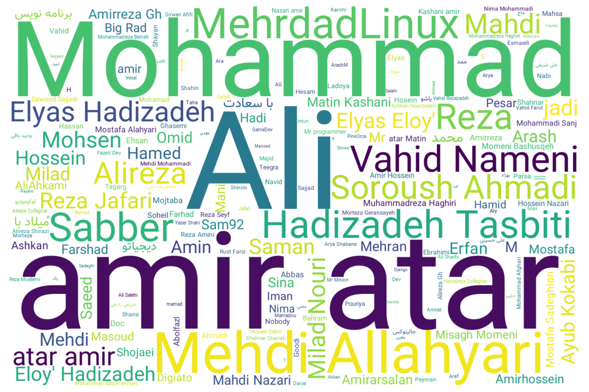

# 🧠 DevTwitter Data Explorations

This repo is a mini data playground based on post data from one of the Telegram channels I follow — focused on some developers' activities.

## 📁 Project Structure

```

assets/
└── Vazir-Regular.ttf                     # Persian-friendly font used in visualizations

images/
├── devtwitter-general-wordcloud.png     # Word cloud of general DevTwitter vocab
├── name-tags-wordcloud.png              # Word cloud from hashtags and name tags
├── programming\_lang\_trends.mp4          # Trend animation of programming languages
└── word\_trends.mp4                      # Time-based trend of word usage

.gitignore                               # Usual ignore rules
devtwitter-pure-text.txt                 # Cleaned raw text version of the dataset
devtwitter.json                          # Original structured data from Telegram post dump
main.ipynb                               # Jupyter notebook with all the analysis + visualizations
README.md                                # You're looking at it 😉

```

## 🖼️ Visual Results

### Word Clouds




### Trend Animations

<p align="center">
  
  
</p>


## 📊 What’s Inside?

Just for fun, I took the shared post data and:

- 🧹 Cleaned and preprocessed it
- 🔍 Analyzed text patterns and hashtags
- 🌐 Visualized keyword frequency (via word clouds)
- 📈 Made some cool trend animations of word usage and programming language mentions

## 🛠️ Tools Used

- Python (Pandas, Matplotlib, WordCloud)
- FFmpeg for animations
- Jupyter for explorations
- VS Code for making magics ✨

## 📂 Data

You can cess the pure data in this repository using `devtwitter-pure-text.txt` and `devtwitter.json` files.

If you'd like to explore the original dataset yourself or grab a fresh copy, it's publicly available here:

🔗 [devtwitter/devtwitter-data](https://github.com/devtwitter/devtwitter-data)

The data primarily consists of post content from a developer-focused Telegram channel, originally curated from some developers channels and discussions. Use it responsibly and with curiosity 🤓

## 🤖 Why This Repo?

This was a quick weekend project to explore how dev communities talk online — particularly on a Telegram channel. Nothing too serious, just a data-curious dive 🧪

## 📬 Contact

[links.ryanheida.com](https://links.ryanheida.com)
